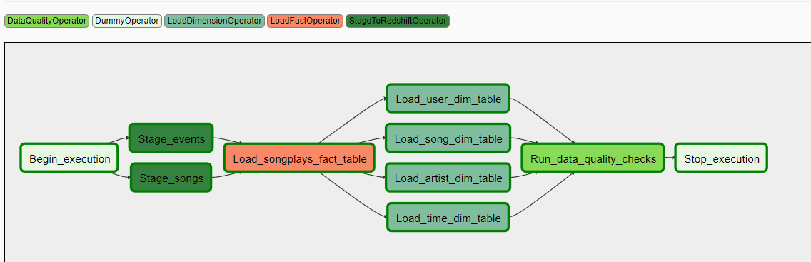

# Data Pipelines with Apache Airflow

## Background

A music streaming company, Sparkify, has decided that it is time to introduce more automation and monitoring to their data warehouse ETL pipelines and come to the conclusion that the best tool to achieve this is Apache Airflow.

## Scope

Scope for this project is to prepare automated data pipeline that follow couple of steps:
 
1. Fetch data from S3 storage
2. Stage this data in Redshift interim tables
3. Fetch data from staging tables
4. Wrangle staging data and prepare for target table input
5. Insert target data
6. Perform quality checks of process

<u>Notes and assumptions:</u>
1. In this project is using massive dataset for song staging but for efficiency’s sake it can be chang in udac_example.dag.py line 50 to      s3_key = 'song_data/A/A/A'
 from original 
s3_key = 'song_data'
   
2. Schedule interval was changed to run once each hour. For only one test run please amend it change in udac_example.dag.py line 25 to  schedule_interval='@once'
 from 
schedule_interval='0 * * * *'
   
## Airflow flow

##  Files structure

1. udac_example_dag.py - main orchestrator file with whole DAG description and dependencies
2. /operators/ - contains custom operators based on existing mechanisms for different phases of project i.e. staging, loading, data checks.
3. /helpers/ - contains python file with all sql queries described
4. create_tables.sql - sql script that need to be run on Redshift cluster BEFORE running whole pipeline

## Usage 

1. Setup Redshift cluster
2. Run create_tables.sql on this cluster
3. Run Airflow and setup connections for aws and redshift
4. Enable DAG